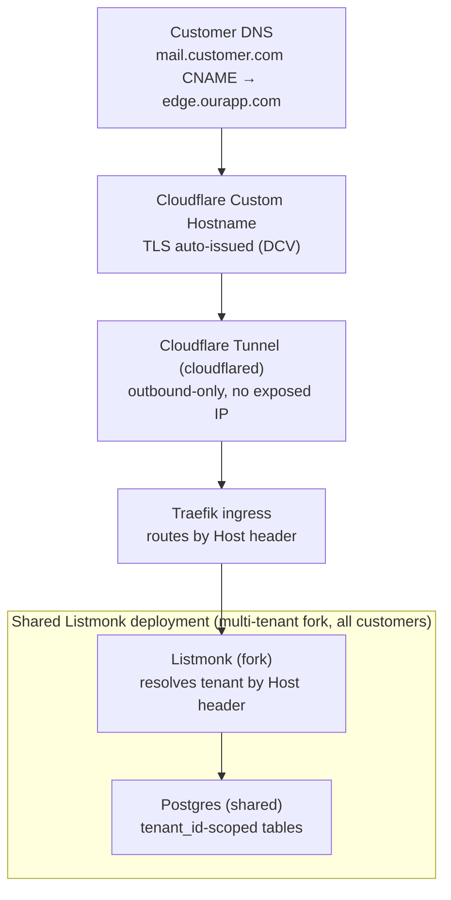
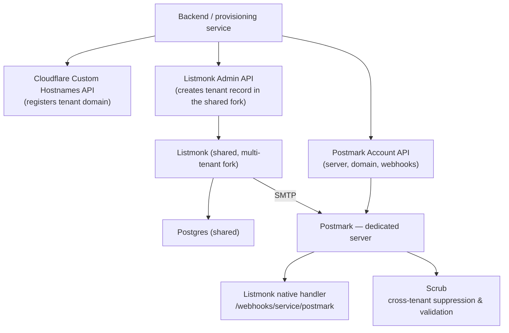
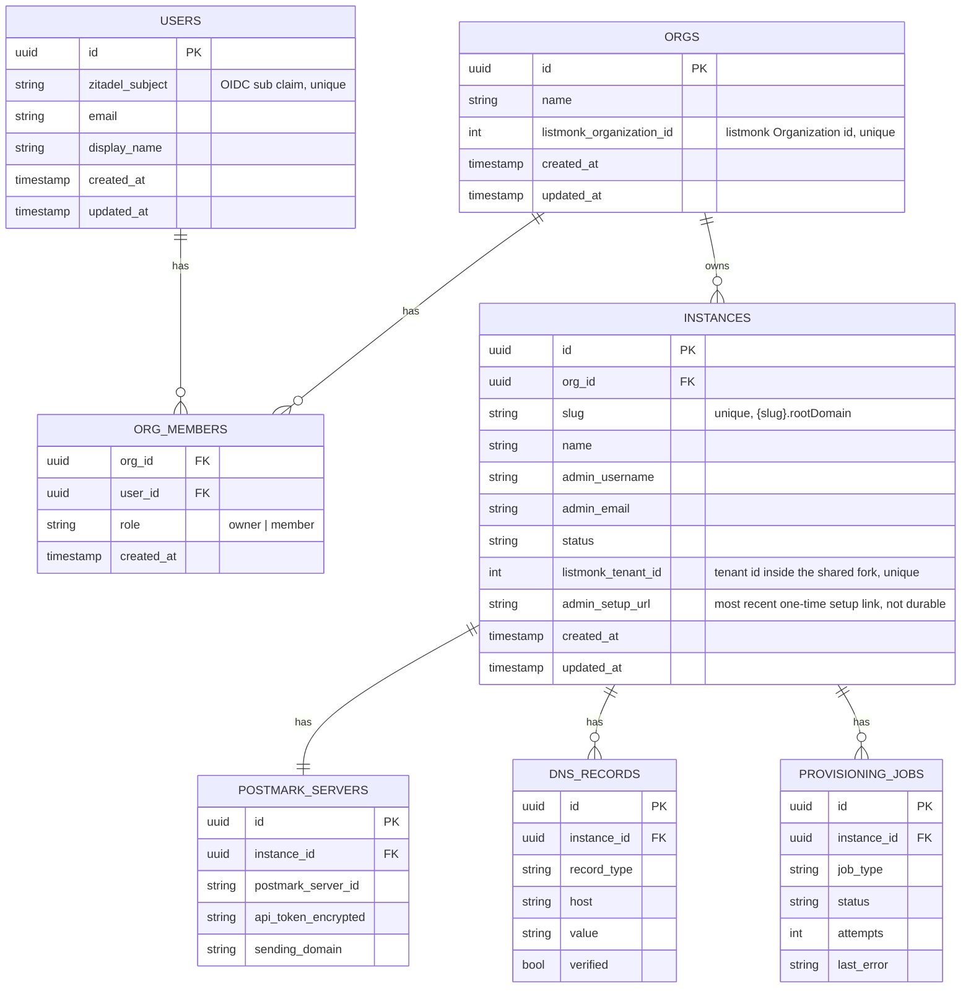
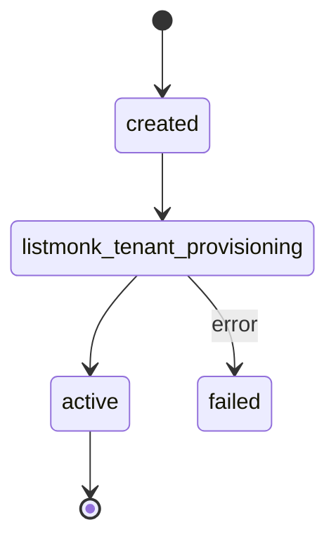
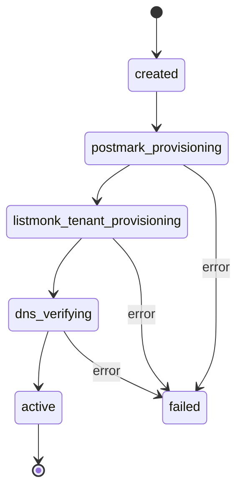

# Listmonk-as-a-Service — Architecture & Build Plan

Scope: Hetzner · k3s · Traefik · Cloudflare Tunnels already in front of the cluster · one Postmark server per tenant · Scrub = address validation & suppression.

Compiled 2026-07-06. Part one is architecture research; part two is a buildable Go backend spec, bootstrapped locally on minikube.

> **Update (2026-07-06):** we've decided to fork Listmonk and add native multi-tenancy to it, rather than running one Listmonk instance (namespace + Deployment + Postgres) per customer as described below. A single shared Listmonk deployment now resolves the tenant per request from the incoming Host header and scopes all queries by `tenant_id`. This removes per-tenant k8s provisioning from the critical path almost entirely — "creating an instance" becomes a tenant row inside the shared fork, plus the still-per-tenant Postmark server and Cloudflare custom hostname. The research below on Postmark, Cloudflare, and k3s/Traefik still holds; the "one Listmonk instance per tenant" framing in the diagrams and text has been updated to match.

> **Update (2026-07-09):** the fork-scoping work flagged above as "still being scoped" is done — all 9 phases of the fork's own `docs/design/multi-tenancy.md` are implemented and live, including a cross-tenant **Operator API** (`/api/operator/*`, static bearer token) that is now this project's actual integration point, superseding the "admin API or direct insert" language used below. Concretely: `POST /api/operator/tenants` (`slug`, `name`, `admin_username`, `admin_email`, optional `organization_id`) creates a tenant and returns a one-time `setup_url` the new admin uses to set their own password (listmonk can't email it — a brand-new tenant has no SMTP config yet); `PUT /api/operator/tenants/{id}/smtp` lets us push Postmark-issued SMTP credentials in directly once that step is built; `PUT /api/operator/tenants/{id}/status` suspends/reactivates/disables. The fork also grew its own cross-tenant **Organization** entity (`POST /api/operator/organizations`) — "so one customer can run multiple tenants... under one umbrella" — which this project's own `orgs` table now mirrors 1:1 rather than duplicating (see the updated data model below). Tenant/organization ids from the fork are **plain integers**, not UUIDs. A real Go backend (`internal/operatorclient`, `internal/provisioning`, `internal/httpapi`) now implements and live-verifies orgs + instance creation against this API end to end — see the Implementation log near the end of this doc.

## Contents

- [Summary](#summary)
- [Research notes](#research-notes)
- [Proposed architecture](#proposed-architecture)
- [Provisioning flow, step by step](#provisioning-flow-step-by-step)
- [Open decisions](#open-decisions)
- [Part two: Go backend build spec](#part-two-go-backend-build-spec)
- [Implementation log](#implementation-log)
- [Sources](#sources)

## Summary

- **The IP-hiding goal is solved by a named product, not a workaround.** Cloudflare for SaaS now ships on every plan, including Free — 100 custom hostnames included, $0.10/mo past that. A customer's domain CNAMEs to one hostname of ours; Cloudflare issues the cert and proxies in. Its "fallback origin" can itself be a hostname served through our existing cloudflared Tunnel, so the origin IP never appears anywhere in the chain.
- **Listmonk is single-tenant upstream** — the maintainers closed the multi-tenancy request as "not planned." We're forking to add it ourselves rather than running one instance per customer; see the update note above.
- **Postmark's Account API makes "one server per tenant" fully scriptable**: create the server, add & verify the sending domain (DKIM/Return-Path), and register webhooks — all before the customer sees anything. This stays per-tenant regardless of the Listmonk multi-tenancy pivot.
- **No fork surgery needed for Scrub's hook point.** Listmonk already ships a native `/webhooks/service/postmark` handler for bounce/complaint processing. Postmark lets us register more than one webhook subscription per server, so Scrub can listen independently on the same triggers — no relay service required.
- **k8s no longer needs to provision anything per tenant.** One shared Listmonk deployment + shared Postgres serves every tenant; Traefik's job per signup shrinks to registering the tenant's custom hostname against that same shared Service, not standing up new infrastructure.

## Research notes

### Listmonk: deployment & extensibility

- Runs as the official `listmonk/listmonk` Docker image + Postgres ≥ 12. Minimal deployment is two containers. Config via env vars, a mounted `config.toml`, or CLI flags; first boot needs `--install`.
  Sources: listmonk.app/docs/installation · hub.docker.com/r/listmonk/listmonk
- Outbound mail is plain SMTP — no provider-specific code, so Postmark drops in as a standard host/port/credential set. Listmonk supports **multiple named SMTP servers**, and SMTP config is settable over its own admin API (`POST /api/smtp`), not just the UI — useful if the provisioner needs to inject the Postmark credentials programmatically after the pod is up.
  Sources: listmonk.app/docs/messengers · github.com/knadh/listmonk#1703, #2971
- Bounce handling has **first-class Postmark support already** — a dedicated endpoint, `/webhooks/service/postmark` — plus SES, SendGrid, Azure, and a generic `/webhooks/bounce` endpoint. There's no general plugin/hook system beyond that.
  Source: listmonk.app/docs/bounces
- Multi-tenancy was requested and **closed as "not planned"** by the maintainers; the acknowledged workaround is fully separate instances per customer — exactly the model already chosen here.
  Sources: github.com/knadh/listmonk#2872, #2765
- Footprint is small: the Go binary itself holds ~256–512MB regardless of list size; combined app+Postgres for a modest list sits around 1–2GB RAM. Postgres, not the app, dominates resource use — relevant for sizing per-tenant pods.
  Source: github.com/knadh/listmonk#584

### Postmark: one server per tenant

- `POST /servers` with the account-level **Account API Token** creates a new server from just a `Name`; the response includes the server's `ID` and up to 3 `ApiTokens`. Basic plan caps at 10 servers — Pro/Platform remove the cap.
  Source: postmarkapp.com/developer/api/servers-api
- Sending domain + DKIM is per-tenant too: `POST /domains` returns a DKIM TXT record and a Return-Path CNAME (→ `pm.mtasv.net`) to publish, then `PUT /domains/{id}/verifyDkim` triggers verification — fully automatable if the provisioner can write to the customer's DNS, otherwise these are the records to hand back to the customer.
  Source: postmarkapp.com/developer/api/domains-api
- Webhooks are per-server and per-trigger via `POST /webhooks` (Server API Token), with independent toggles for `Bounce`, `SpamComplaint`, `Delivery`, etc. **Multiple webhook subscriptions can coexist on one server** — so Listmonk's own endpoint and Scrub's endpoint can each register independently for the same triggers.
  Source: postmarkapp.com/developer/api/webhooks-api
- SMTP works cleanly for Listmonk: the **Server API Token doubles as the SMTP username and password** (or use a dedicated SMTP token). No custom transport code needed on the Listmonk side.
  Source: postmarkapp.com/support/article/811
- No published numeric API rate limit; expect/handle 429s. SMTP guidance: ≤10 concurrent connections per IP, no hard send-rate enforcement.
  Source: postmarkapp.com/support/article/do-we-have-rate-limits-for-smtp

### Custom domains without exposing an IP

- **Cloudflare for SaaS** gives every tenant one CNAME target; we register their hostname via the `Custom Hostnames` API and Cloudflare auto-issues + renews the TLS cert and proxies matching traffic to a fallback origin we configure.
  Source: developers.cloudflare.com/cloudflare-for-platforms/cloudflare-for-saas
- Now available on **every plan, Free included** — 100 custom hostnames free, $0.10/hostname/month after, up to 50,000 self-serve. This was Enterprise-only in the past; worth confirming the account is on a plan that reflects current pricing.
  Source: developers.cloudflare.com/cloudflare-for-platforms/cloudflare-for-saas/plans
- The fallback/custom origin does **not** need to be a bare IP — Cloudflare documents a "Tunnel as fallback origin" reference architecture: origin = a proxied hostname served by our existing `cloudflared` Tunnel. This is the piece that lets a stranger's domain reach the cluster with the origin IP never appearing anywhere.
  Source: developers.cloudflare.com/reference-architecture/.../extending-cloudflares-benefits-to-saas-providers-end-customers
- What doesn't work: routing a tunnel directly via `cloudflared tunnel route dns` for a customer's own domain — that only functions when the DNS record lives in *our* Cloudflare account. A customer's domain, in their own account or registrar, can't CNAME straight to our `cfargotunnel.com` hostname. Cloudflare for SaaS is the piece that removes this restriction.
  Source: developers.cloudflare.com/tunnel/routing
- Limits: 1,000 tunnels and 1,000 routes per account; no documented per-tunnel hostname cap (one community report of a 5-hostname limit in a different, Zero Trust Applications context — unconfirmed officially).
  Source: developers.cloudflare.com/cloudflare-one/account-limits

### Provisioning inside k3s

- Two viable patterns for turning a signup into live resources: the **backend calls the k8s API directly** (render a manifest/Helm template, apply Namespace + Deployment + Service + IngressRoute), or a **lightweight operator** (a `ListmonkInstance` CRD reconciled with something like Kopf) that gets drift-correction and self-healing for free from etcd-backed state. Operators pay off once lifecycle management (upgrades, backup, failover) gets complex — for a templated, repeatable workload like this, either is defensible; imperative is faster to ship, an operator scales better past a few dozen tenants.
  Sources: kubernetes.io/docs/concepts/extend-kubernetes/operator · kopf.dev
- Traefik's Kubernetes CRD/Ingress providers watch the API server directly — a new `IngressRoute` is picked up and live **with no restart**, which is what makes per-tenant routing practical at signup time.
  Source: doc.traefik.io/traefik/providers/kubernetes-crd
- Community consensus (including from CloudNativePG's own maintainers) favors **one small Postgres cluster per tenant** over packing many tenant databases into one shared cluster — a shared cluster is a shared blast radius. CloudNativePG is the more actively maintained option versus Zalando's Patroni-based operator for running many small clusters.
  Sources: github.com/cloudnative-pg/cloudnative-pg/discussions/2357 · cloudnative-pg.io
- **Namespace-per-tenant** is the standard recommendation at tens-to-hundreds of tenants — each gets its own ResourceQuota/LimitRange and NetworkPolicy default-deny, cheaper than cluster-per-tenant, stronger than shared-namespace-with-labels. It's isolation-by-convention (control plane components are still shared), not hard multi-tenancy.
  Source: kubernetes.io/docs/concepts/security/multi-tenancy

## Proposed architecture

### 1 — Request path

How mail-open/click traffic and the admin UI reach a tenant. The origin IP appears nowhere between the customer's browser and Traefik — only the Tunnel's outbound session does.



Plain-text version:

```
┌──────────────────────────────
│ Customer DNS
│ mail.customer.com  CNAME → edge.ourapp.com
└──────────────┬───────────────
               │
┌──────────────▼───────────────
│ Cloudflare — Custom Hostname
│ TLS auto-issued (DCV)
└──────────────┬───────────────
               │
┌──────────────▼───────────────
│ Cloudflare Tunnel (cloudflared)
│ outbound-only — no exposed IP
└──────────────┬───────────────
               │
┌──────────────▼───────────────
│ Traefik ingress
│ routes by Host header → this tenant's IngressRoute
└──────────────┬───────────────
               │
- - - - - - - -│- - - - - - - - - - - - - - - - - - - - -
   shared Listmonk deployment (multi-tenant fork)     │
┌──────────────▼─────────────┐        ┌──────────────────────────┐
│ Listmonk (fork)             │───────▶│ Postgres (shared)         │
│ resolves tenant by Host hdr │        │ tenant_id-scoped tables   │
└──────────────────────────────┘        └──────────────────────────┘
- - - - - - - - - - - - - - - - - - - - - - - - - - - - - - - - - -
```

The origin IP appears nowhere in this chain — only the Tunnel's outbound session does.

### 2 — Provisioning & mail path

What stands up when a tenant is created, and how mail flows out and bounces flow back. Two separate Postmark webhook subscriptions on the same server — same triggers, no relay service needed.



Plain-text version:

```
Backend / provisioning service
  │
  ├──▶ Cloudflare Custom Hostnames API
  │      registers the tenant's domain (see diagram 1)
  │
  ├──▶ Listmonk Admin API
  │      creates this tenant's record in the shared fork
  │      │
  │      ├──▶ Listmonk (shared, multi-tenant fork)  ──sends via SMTP──▶ (Postmark server, below)
  │      │
  │      └──▶ Postgres (shared)
  │
  └──▶ Postmark Account API
         creates the dedicated server, sending domain, and webhooks below
         │
         ▼
       Postmark — dedicated server
         │
         ├──▶ Listmonk's native handler   /webhooks/service/postmark
         │
         └──▶ Scrub                       independent webhook subscription —
                                           cross-tenant suppression & validation
```

Two separate Postmark webhook subscriptions on the same server — same triggers, no relay service needed.

## Provisioning flow, step by step

1. **Customer submits domain.** Customer enters `mail.customer.com` and confirms; backend records the tenant as `pending`.
2. **Backend → Postmark: provision the server.** `POST /servers` for this tenant, then `POST /domains` for their sending domain — returns the DKIM TXT and Return-Path CNAME to publish.
3. **Publish DNS records.** DKIM TXT + Return-Path CNAME for sending, plus the custom-hostname CNAME for the app itself. Automatable only if the customer's DNS is delegated to a provider we control.
4. **Backend → Cloudflare: register the custom hostname.** `POST /zones/{id}/custom_hostnames` with the fallback origin set to the Tunnel-served hostname; backend polls until `ssl.status = active`.
5. **Backend → Listmonk Admin API: create the tenant record.** Inserts this tenant into the shared, multi-tenant Listmonk fork with the Postmark SMTP credentials scoped to it, and registers a Traefik `IngressRoute` matching the customer's domain against the same shared Service — no new namespace, Deployment, or Postgres cluster.
6. **Backend → Postmark: wire up webhooks.** Two webhook subscriptions on the tenant's server: one to the shared Listmonk fork's `/webhooks/service/postmark` (which routes internally by tenant), one to Scrub — both listening for `Bounce` and `SpamComplaint`.
7. **Flip to active.** Once DKIM verifies, the Cloudflare hostname is active, and the pod is healthy, the tenant is marked live and the customer is notified.

## Open decisions

> Superseded by the multi-tenancy pivot: the two decisions below ("imperative vs. operator" and "per-tenant vs. shared Postgres") were about provisioning a whole Listmonk+Postgres stack per tenant in k8s. That no longer happens — there's one shared Listmonk deployment and one shared Postgres, full stop. k8s work shrinks to running that single deployment reliably (an ordinary ops concern, not a per-signup one) plus registering each tenant's Traefik route and Cloudflare hostname. Left here for the record; superseded, not deleted.
>
> - ~~Imperative provisioning script vs. a CRD/operator?~~ — moot, nothing per-tenant to provision in k8s.
> - ~~Postgres: one CloudNativePG cluster per tenant, or shared cluster with per-tenant databases?~~ — moot, it's shared by construction now. What replaced it — how `tenant_id`/RLS scoping works inside the forked Listmonk schema — is answered: see the fork's own `docs/design/multi-tenancy.md` (all 9 phases done) and the 2026-07-09 update note at the top of this doc.

- **DNS automation for DKIM/Return-Path: auto-publish or hand back to the customer?**
  - If customer domains are delegated to a DNS provider we have API access to, records can be created and verified with zero customer action.
  - Otherwise, the provisioning flow needs a "here are the records to add" step and a verification poll loop before the tenant can go live.
- **Does Scrub only consume bounce/complaint webhooks, or also gate sends before they leave Listmonk?**
  - Webhook-only (as diagrammed): Scrub builds its suppression list reactively from Postmark events — simplest, no changes to Listmonk's send path.
  - Pre-send gating would require an actual fork change to Listmonk's send path to check Scrub before dispatch — bigger lift, worth it only if reactive suppression isn't fast enough to stop a bad send.

---

## Part two: Go backend build spec

A buildable v1: single Go service, control-plane Postgres, provisioning driven by client-go against a local minikube cluster. Prod (Hetzner/k3s/Traefik/Cloudflare Tunnel) is the same shape — only the kubeconfig context and a couple of feature flags change.

### v1 scope: the one call that shrinks this bootstrap a lot

Ship v1 with tenants on **`{slug}.ourapp.com`** — a subdomain of a domain we already own — and defer bring-your-own-domain to v1.1. This isn't scope creep avoidance for its own sake, it removes an entire integration from the critical path:

- **No Cloudflare Custom Hostname API in v1.** One wildcard DNS record (`*.ourapp.com`) and one wildcard cert, set up once. The per-tenant Traefik `IngressRoute` from diagram 1 still applies — only its host is a subdomain we control, not a stranger's domain. The whole "custom domains" research above is still correct and still needed — it just becomes v1.1's job, not v1's.
- **No manual DNS step for the customer, even for Postmark.** If the sending domain is also our zone (e.g. `mail.{slug}.ourapp.com`), the backend can publish the DKIM TXT and Return-Path CNAME that Postmark's Domains API returns via our own DNS provider's API, then call `verifyDkim` itself. Zero copy-paste DNS instructions in the UI for v1.
- Everything else researched above — one Postmark server per tenant, the native Listmonk webhook — is unchanged. This is a scope cut on *custom domains only*, not a different architecture. (Note: the namespace-per-tenant/CloudNativePG-per-tenant framing this bullet originally pointed at is superseded by the multi-tenancy fork pivot above — there's one shared Listmonk deployment and one shared Postgres regardless of v1 vs. v1.1.)

### Tech stack

| Concern | Choice | Why |
|---|---|---|
| Language / layout | Go, `cmd/api` + `cmd/worker` | One module, two entrypoints sharing `internal/` — no microservices to deploy for v1. `cmd/worker` is still a bootstrap stub — nothing runs on it yet since there's no River queue behind it (see Background jobs below). |
| HTTP router | **chi — in use** | `internal/httpapi`. Idiomatic `net/http`, middleware chain, no magic. |
| Control-plane DB | **Postgres + pgx + sqlc — in use** | Typed queries generated from SQL we actually write (`db/queries/*.sql` → `internal/db`); no ORM behavior to fight. |
| Migrations | **golang-migrate — in use** | `cmd/migrate` (`go run ./cmd/migrate [-direction up\|down]`) wraps the library against `db/migrations/0001_init.{up,down}.sql` and `DATABASE_URL`. Explicit step, not run automatically by `cmd/api`/`cmd/worker` on boot. |
| Background jobs | River (confirmed, **not yet wired**) | `CreateInstance`'s one real step currently runs synchronously in the request handler — nothing to retry asynchronously yet with only one step. Revisit once Postmark/DNS jobs land (see Provisioning state machine). |
| Kubernetes client | client-go (ops only) | Not needed at all yet — day-2 ops on the one shared deployment isn't in scope for what's been built so far. |
| Postmark client | Thin hand-rolled HTTP client | Not yet built. |
| listmonk Operator client | **Hand-rolled HTTP client — in use** | `internal/operatorclient`. Same "no SDK, small surface" reasoning as Postmark below — this is a fork-only API, nothing upstream ships a client for. Live-verified against a real dev listmonk instance (see Implementation log). |
| Cloudflare client | `cloudflare-go` (official SDK) | Only wired up in v1.1 when Custom Hostnames come into scope. |
| Auth | **Zitadel (OIDC) — in use, live-verified** | `internal/authn` verifies the bearer token against Zitadel's JWKS (go-oidc) and JIT-provisions a `users` row keyed by the `sub` claim on first sight (`internal/provisioning.JITProvisionUser`). Both the JWKS verification and JIT provisioning are live-verified against the docker-compose dev Zitadel (v4.12.1) -- see Implementation log. |
| Config | Env vars, `.env` for local dev | `internal/config` now also carries `LISTMONK_OPERATOR_BASE_URL`/`_TOKEN` and `LISTMONK_ROOT_DOMAIN` alongside the DB/HTTP/Zitadel settings. |

### Data model (control-plane Postgres)

This is the backend's own database — separate from the shared Listmonk fork's own Postgres, which the fork itself owns and scopes by `tenant_id`. Implemented in `db/migrations/0001_init.up.sql`, current as of the Implementation log below.

An **org**, not a user, owns instances — a user reaches an instance only via org membership (`org_members`, role `owner`/`member`), never directly. Every user gets a personal org auto-created on first login. Each org mirrors 1:1 onto the listmonk fork's own cross-tenant **Organization** (`orgs.listmonk_organization_id`, an integer there, not a uuid) — created via the Operator API *before* the local org row, so a local org is never left without its listmonk twin. Instances carry `listmonk_tenant_id` (also an integer) once provisioned, plus the admin identity (`admin_username`/`admin_email`) the Operator API needs, and `admin_setup_url` — the most recent one-time setup link, never treated as durable since its token lives only in the fork's memory and is lost on its restart (hence the "resend setup link" endpoint below, not a stored secret).



Relationships summary:

```
users            1 ──── * org_members       a user belongs to many orgs (owner/member)
orgs             1 ──── * org_members       an org has many members
orgs             1 ──── * instances         an org owns many instances; mirrors a listmonk Organization
instances        1 ──── 1 postmark_servers  each instance has exactly one Postmark server (not yet built)
instances        1 ──── * dns_records       each instance has many DNS records (DKIM, Return-Path, ...) (not yet built)
instances        1 ──── * provisioning_jobs each instance has many provisioning job records
```

### REST API surface (v1)

Implemented in `internal/httpapi`; below reflects what's actually wired up, not just planned.

**Auth**

No `/api/v1/auth/*` endpoints — the frontend authenticates directly against Zitadel (OIDC Authorization Code flow) and sends the resulting access token as a Bearer header on every API call. Backend middleware (`internal/authn`, go-oidc) verifies it against Zitadel's JWKS and JIT-provisions a `users` row (keyed by the `sub` claim) the first time it sees a subject it doesn't recognize — plus a personal org and its listmonk Organization twin; no signup/login/refresh/logout handlers of our own to build or secure. **Not yet live-tested against a real Zitadel tenant** (none is configured in dev) — the layers under it (org/instance logic, DB, Operator API calls) are.

**Orgs**

| Method | Path | Does |
|---|---|---|
| GET | `/api/v1/orgs` | List the caller's orgs |
| POST | `/api/v1/orgs` | Create an additional org (e.g. a second brand) — also creates its listmonk Organization |

**Instances** (every route below requires the caller to be a member of `{orgID}`, enforced by `RequireMembership`)

| Method | Path | Does |
|---|---|---|
| POST | `/api/v1/orgs/{orgID}/instances` | Create instance: provisions a real tenant via the Operator API, synchronously (see Provisioning state machine below) |
| GET | `/api/v1/orgs/{orgID}/instances` | List this org's instances + status |
| GET | `/api/v1/orgs/{orgID}/instances/{id}` | Instance detail: status, listmonk tenant id, setup URL |
| GET | `/api/v1/orgs/{orgID}/instances/{id}/events` | Provisioning timeline for the UI (maps to `provisioning_jobs`) |
| POST | `/api/v1/orgs/{orgID}/instances/{id}/setup-link` | Reissue the admin's one-time setup link (the original's token is lost on a listmonk restart) |

**Not yet built**: `DELETE .../instances/{id}` (the `DeleteInstance` query exists; no handler wraps it yet) and a `retry` endpoint — moot until there's more than one provisioning step to retry (see below).

### Provisioning state machine

**Currently implemented (`internal/provisioning.CreateInstance`): one step, run synchronously, no queue yet.** `created` → `listmonk_tenant_provisioning` → `active`, or `failed` if the Operator API call errors (most commonly a taken slug, surfaced as `ErrSlugTaken`). A `provisioning_jobs` row (`job_type = "provision_listmonk_tenant"`) still records this step for the UI's timeline even without River behind it — there's nothing to retry asynchronously yet since there's only one step, so this runs inline in the request handler rather than being enqueued.



**Planned, not yet built:** the fuller job chain below, once Postmark and DNS work starts. This is where River earns its place in the stack — multiple steps with real retry/backoff needs, unlike today's single synchronous call.



In v1.1, a `cloudflare_provisioning` step slots in between `postmark_provisioning` and `listmonk_tenant_provisioning` — registering the tenant's own Custom Hostname before the Traefik route is created for it.

| Job (River) | Does | Idempotency |
|---|---|---|
| `create_postmark_server` | Calls Postmark `POST /servers` + `POST /domains`, stores the token encrypted, then pushes the resulting SMTP credentials into the tenant via the Operator API's `PUT /api/operator/tenants/{id}/smtp` (confirmed to exist and accept an arbitrary SMTP entry — listmonk has no provider-specific knowledge, it just stores what it's given) | Checks `postmark_servers` for an existing row before creating |
| `publish_dns_records` | Writes DKIM TXT + Return-Path CNAME to our own DNS zone via its API | Upserts by record name |
| `provision_listmonk_tenant` | **Implemented today**, synchronously — see above. Calls `POST /api/operator/tenants` with `slug`/`name`/`admin_username`/`admin_email`/`organization_id` | Local `instances.slug` UNIQUE constraint plus the Operator API's own 409 both catch a collision; either maps to `ErrSlugTaken` |
| `register_webhooks` | Two Postmark webhook subscriptions: the shared fork's webhook endpoint, and Scrub | Lists existing subscriptions first, skips if present |
| `verify_dkim` | Polls `PUT /domains/{id}/verifyDkim` until verified, then flips instance to `active` | Pure re-check, safe to repeat |

### Local development on minikube

The goal is dev/prod parity on the pieces that matter — same ingress controller, same Postgres operator — while stubbing the two things minikube genuinely can't do: serve a public hostname, and prove a Cloudflare Tunnel.

```sh
minikube start --cpus=4 --memory=8192 --driver=docker

# mirror prod's ingress controller instead of the nginx addon
helm repo add traefik https://traefik.github.io/charts
helm install traefik traefik/traefik -n traefik --create-namespace

# mirror prod's Postgres operator (now backs the one shared Listmonk Postgres, not per-tenant clusters)
kubectl apply --server-side -f https://raw.githubusercontent.com/cloudnative-pg/cloudnative-pg/main/releases/cnpg-1.24.0.yaml

# point client-go at minikube -- no in-cluster config locally
kubectl config use-context minikube

# control-plane Postgres + Postmark sandbox token via .env
docker compose up -d postgres
go run ./cmd/api
go run ./cmd/worker
```

- **App hostname:** since v1 uses `*.ourapp.com`, add tenant slugs to `/etc/hosts` pointed at `minikube ip` for local browser testing — no real DNS or Cloudflare involvement needed to exercise the full provisioning path.
- **Postmark:** use a real Account API token against a sandbox-mode server (`DeliveryType: sandbox`) — every API call in the job chain runs for real, no mail actually sends.
- **Cloudflare:** not called at all in v1 locally. When v1.1's `cloudflare_provisioning` job is built, it's feature-flagged off in the local environment and exercised against a staging zone instead.

### Build order

1. **~~Zitadel-authenticated instance CRUD skeleton.~~ Done, with more scope than originally planned: orgs, not just users, own instances.** `internal/httpapi`/`internal/provisioning` implement org + instance CRUD against real Postgres; `internal/authn`'s token verification is live-verified against a real docker-compose Zitadel. See Implementation log.
2. **~~Shared Listmonk deployment~~ Already running (a real dev instance, not minikube) — skip straight to `provision_listmonk_tenant`, done.** No k8s/Traefik/IngressRoute work needed for this step at all: the fork's own Operator API (`POST /api/operator/tenants`) is the entire integration point, and it's live-verified end to end including correct org→Organization grouping. First milestone with a real, browsable tenant — done ahead of the k8s work it was originally sequenced after.
3. **Postmark integration.** Server + domain creation, DNS record publishing to our own zone, DKIM verification polling, SMTP credentials pushed into the tenant via the now-confirmed `PUT /api/operator/tenants/{id}/smtp`. Not started.
4. **Webhooks + Scrub.** `register_webhooks` job wires the shared fork's webhook endpoint and Scrub as two independent subscriptions. Not started.
5. **Teardown + retry.** `DELETE /instances/{id}` reverses every job in the chain; `retry` re-enqueues a stalled step. Not started — moot until step 3/4 give the job chain more than one step to retry.
6. **v1.1 — bring-your-own domain.** Layers in the Cloudflare Custom Hostnames flow from part one — `cloudflare_provisioning` job, DNS-records-to-publish UI step, hostname status polling. Everything it needs was already researched above. Not started.

## Implementation log

Mirrors the style of the listmonk fork's own `docs/design/multi-tenancy.md` decisions log — what actually shipped and was verified, not just planned, kept separate from the forward-looking sections above so neither goes stale into the other.

- **Schema corrected to match the real Operator API (2026-07-09).** `db/migrations/0001_init.up.sql`'s `instances` table predated the multi-tenancy pivot and still had `k8s_namespace`/`domain` (no `listmonk_tenant_id` at all). Fixed to match what `POST /api/operator/tenants` actually needs and returns: `slug` (with the same regex the Operator API enforces, added as a `CHECK` constraint), `name`, `admin_username`, `admin_email`, `listmonk_tenant_id integer` (the fork's tenant ids are plain integers, confirmed live — not uuids), `admin_setup_url`. Regenerated `internal/db` via `sqlc generate`; `go build`/`go vet` clean.
- **Orgs added, instances re-scoped from `user_id` to `org_id` (2026-07-09).** New `orgs`/`org_members` tables (role `owner`/`member`); a user reaches an instance only via org membership. Every user gets a personal org auto-created on first login.
- **Discovered mid-implementation: the listmonk fork already has a native cross-tenant `Organization` entity** (`POST /api/operator/organizations`, `organization_id` on tenant creation, `PUT /api/operator/tenants/{id}/smtp`) — none of this was visible when the "still being scoped" line above was originally written; the fork moved forward independently. Rather than let listnun's own `orgs` duplicate this, `orgs.listmonk_organization_id` mirrors it 1:1: `internal/provisioning.createListmonkOrganization` creates the listmonk Organization *first*, so a local org row is never written without its twin (nothing to reconcile on partial failure — the local insert just doesn't happen). The listmonk-side name is disambiguated with the local org's own id (personal-org names like "Alex's org" collide often, and `organizations_name_key` is a global unique constraint) — this name is never user-facing, since Organization is Operator-API-only by design and listnun always displays its own `orgs.name`.
- **Built and live-verified `internal/operatorclient`, `internal/provisioning`, `internal/httpapi` end to end (2026-07-09)**, against a real Postgres (throwaway Docker container, migration applied for real) and the real dev listmonk instance on `:9000` (not a stub) — not just `go build`/`go vet` clean:
  - JIT-provisioning is idempotent (same Zitadel subject twice → same user, same one org, not duplicated).
  - `CreateInstance` provisions a real tenant via the Operator API; the tenant shows up correctly grouped under its org's mirrored Organization (confirmed via `GetOrganization`'s `tenant_count` and tenant list).
  - Cross-org access is rejected (`RequireMembership` fails closed).
  - **A real bug was caught by this testing, not by review**: `instances.slug` is UNIQUE locally (correctly — listmonk tenant slugs are one flat namespace across every org on the platform, confirmed via the live tenant list), so a duplicate-slug `CreateInstance` call was failing at that local constraint *before* ever reaching the Operator API, and the error wasn't being translated to `ErrSlugTaken` the way the Operator API's own 409 already was. Fixed by checking the Postgres constraint name (`instances_slug_key`) alongside `operatorclient.IsConflict`.
  - `ResendSetupLink` reissues a real setup link via the Operator API's own reissue endpoint.
  - Cleaned up after itself: disabled (no delete endpoint exists, by the fork's own design) every tenant/organization this testing created on the shared dev listmonk instance.
- **Zitadel added to the dev stack, closing the auth/invite live-test gaps (2026-07-09).** `docker-compose.yml` now runs Zitadel v4.12.1 + its own Postgres + the v4 split login UI (adapted from the already-proven block in `/home/tawanda/work/scrub`'s compose, remapped to port 8081 -- 8080 was already bound by listmonk's frontend dev server). Auto-bootstraps an admin console login and a machine user + PAT on first boot, no manual console step needed. This let both previously-flagged gaps close for real:
  - `internal/authn.NewVerifier` did real OIDC discovery + JWKS fetch against it and correctly rejected a garbage token.
  - Using the automation PAT, created a real machine user via the Management API, generated it a real key, and ran `internal/zitadelmgmt.InviteHuman` against it -- confirmed (via a follow-up API read, not just the create response) that it created a genuine human user.
  - **Found and fixed a real bug along the way**: `internal/zitadelmgmt` had no way to talk to a plaintext dev Zitadel at all -- added `WithInsecurePort`. Also fixed `config.parseZitadelHost`, which previously would have smashed a port straight into the SDK's bare-host field (`"localhost:8081:443"`) for any issuer URL that included one, instead of splitting host from port.
- **Known gaps, left as-is deliberately, not oversights:**
  - `CreateInstance`'s Operator API call runs synchronously in the request handler, not through River — there's only one real step today, so nothing to retry asynchronously yet. Revisit once Postmark/DNS steps (build-order step 3) land.
  - No `DELETE .../instances/{id}` or `retry` HTTP handler yet (the underlying `DeleteInstance` sqlc query exists, unused).
  - **Resolved (2026-07-09):** `cmd/migrate` wraps `golang-migrate` for real now (`go run ./cmd/migrate`) — live-verified against the docker-compose dev DB: `up`, `down` (full round-trip back to a bare `schema_migrations` table), re-`up`, and a redundant `up` correctly resolving as a no-op (`migrate.ErrNoChange`) rather than an error. Still an explicit step, not run automatically by `cmd/api`/`cmd/worker` on boot.

## Sources

**Listmonk**
- https://listmonk.app/docs/installation/
- https://listmonk.app/docs/messengers/
- https://listmonk.app/docs/bounces/
- https://github.com/knadh/listmonk/issues/2872 (multi-tenancy, not planned)
- https://github.com/knadh/listmonk/issues/1703 (per-campaign SMTP)
- https://github.com/knadh/listmonk/issues/2971 (per-SMTP throttling)
- https://github.com/knadh/listmonk/issues/584 (hardware requirements)

**Postmark**
- https://postmarkapp.com/developer/api/servers-api
- https://postmarkapp.com/developer/api/domains-api
- https://postmarkapp.com/developer/api/webhooks-api
- https://postmarkapp.com/support/article/811-what-are-the-smtp-details-api-tokens-i-should-be-using
- https://postmarkapp.com/support/article/1091-how-do-i-set-up-dkim-for-postmark
- https://postmarkapp.com/support/article/1209-is-there-a-limit-to-how-many-servers-or-users-that-i-can-have

**Cloudflare**
- https://developers.cloudflare.com/cloudflare-for-platforms/cloudflare-for-saas/
- https://developers.cloudflare.com/cloudflare-for-platforms/cloudflare-for-saas/start/advanced-settings/custom-origin/
- https://developers.cloudflare.com/reference-architecture/design-guides/extending-cloudflares-benefits-to-saas-providers-end-customers/
- https://developers.cloudflare.com/cloudflare-for-platforms/cloudflare-for-saas/plans/
- https://developers.cloudflare.com/tunnel/routing/
- https://developers.cloudflare.com/cloudflare-one/account-limits/

**Kubernetes**
- https://kubernetes.io/docs/concepts/extend-kubernetes/operator/
- https://kopf.dev/
- https://doc.traefik.io/traefik/v3.4/providers/kubernetes-crd/
- https://github.com/cloudnative-pg/cloudnative-pg/discussions/2357
- https://cloudnative-pg.io/
- https://kubernetes.io/docs/concepts/security/multi-tenancy/
- https://kubernetes.io/docs/concepts/policy/resource-quotas/

---

*Re-verify pricing/limits above before relying on them for launch planning. chi, sqlc, and the listmonk Operator client are now actually in use, not just chosen (see Tech stack and Implementation log); River was confirmed by direct request but isn't wired up yet. The rest are defaults chosen for a fast, low-dependency bootstrap and open to change.*
